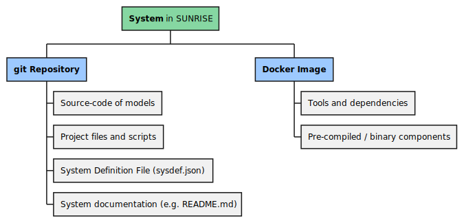
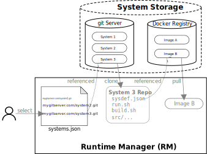
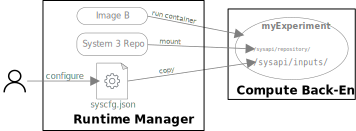
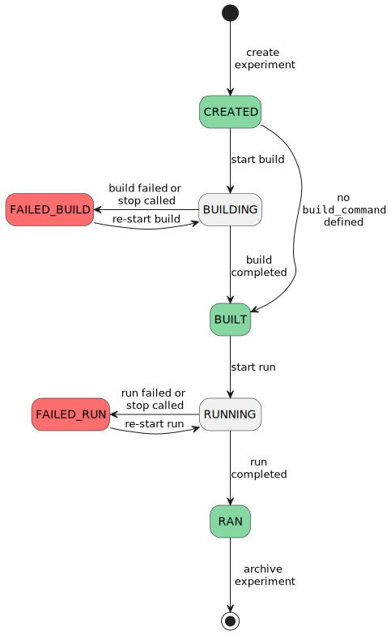

# API Specification
The APIs define the structure of the [SUNRISE framework](components.md#overview), enable modularity and separation of responsibilities:

- [System API (SysAPI)](#system-api-sysapi) for system integration
- [Evaluation API (EvalAPI)](#evaluation-api-evalapi) for front-end connection


---
## System API (SysAPI)
The _SysAPI_ is used to access systems in the SUNRISE framework and execute them on compute back-ends. A central paradigm is the independence of the API from the specific implementation of the functionality inside the system, to support a wide range of simulation solutions available on the market and even use cases in other domains. Note that the SysAPI for system integration is independent of the EvalAPI for the front-end, which is hosted by the Runtime Manager. The SysAPI can also be used standalone and locally by the user to run simulations.

The SysAPI definition comprises a sequence of actions and a set of definitions for files. The _API concept_ is interpreted in a wider sense than just a function interface or communication protocol. The specification of the API includes to the definition of the interface of systems and their functional encapsulation.

### System Components
A system in SUNRISE consists of the two main components:

- A **git repository** which holds the metadata description in the [_System Definition (SysDef)_](dataformats.md#system-definition-file-sysdef) JSON file and the components which are provided in source code to be compiled during the build step of the workflow. The repository shall be made available using a git server.
- A **Docker image** containing the runtime environment of the system, such as the simulation tool along with its dependencies and linked pre-compiled models. The image shall be accessible in a container registry.



The _SysAPI_ specification comprises a sequence of actions and a set of definitions for files. The API concept is interpreted in a wider sense than just a function interface or communication protocol. The API includes to the definition of the interface of systems and their functional encapsulation.

### Preparation
An exemplary SysDef file, for a fictitious system is shown below. It contains the name and version to identify the system and the link to the exemplary Docker image on a container registry.
The strings in `build_command` and `run_command` define the action that will be called inside the container to build, respectively run, the simulation. The remaining entries define user-configurable parameters that are used during the build and run actions, along with default values for each. Finally, the result objects that are produced by the system during the run action are declared.

*System Definition (SysDef):*
```json
{
  "name": "System 3",
  "version": "1.2",
  "docker_image": "my_registry.com/image-b:demo",
  "build_command": "python build.py",
  "run_command": "source run.sh",
  "build_parameters": {
    "compile_args": "-O3 -Wall"
  },
  "run_parameters": {
    "run_time_ms": 1000,
    "app": {
      "default_value": "demo_application/demo.elf",
        "meta": {
          "is_file": true
        },
        "description": "App binary to execute on the CPU"
    },
    "simulator_args": "--verbose"
  },
  "results": {
    "signal_trace": {
      "path": "vp/output/sim_trace.vcd",
      "type": "vcd"
    }
  }
}
```

### Experiment Creation
To keep track of the systems that are available, the Runtime Manager holds a list of links to the git repositories (e.g. in a _systems.json_ file).
The simulation workflow is started when the user selects one of the referenced systems to create a new experiment. During experiment creation, the git repository is cloned by the Runtime Manager, the required Docker image name is extracted from the included SysDef file and the image is pulled from the registry.



### Action Execution
To perform the build and run actions in the experiment, a Docker volume is created by the Runtime Manager to transfer data into the Docker container and keep result files afterwards. The following directories are defined for the SysAPI:

- `/sysapi/repository/` contains the system repository that was cloned from the git server
- `/sysapi/inputs/` is used for additional data that is provided to the system, like file parameters (`app` in this example)
- `/sysapi/outputs/` recommended directory for the system to provide data back to the user  (`signal_trace` in this example)


For the execution of the build and the run action, the [_System Configuration (SysCfg)_](dataformats.md#system-configuration-file-syscfg) JSON file is created. It is derived from the SysDef and holds user-modified configuration parameters to be used during the build and run actions. For parameters not present in the SysCfg (in the example `run_parameters.simulator_args`), the default value from the SysDef shall be used by the system. Further information about the SysCfg and the parameter conversion process can be found in the [data formats](dataformats.md) section.

The Runtime Manager copies the SysCfg file into the experiment volume under the `inputs/` directory.


_System Configuration (SysCfg):_
```json
{
  "system": {
    "name": "System 3",
    "version": "1.2"
  },
  "build_parameters": {
      "compile_args": "-Os"
  },
  "run_parameters": {
    "run_time_ms": 20,
    "app": "/sysapi/inputs/myApp.elf"
  }
}
```

After the preparation steps, the Docker container can be started to perform an action. The working directory is set to the repository directory in the mounted volume (`/sysapi/repository`) and the action call (`build_command` / `run_command`) from the SysDef file is appended as command to docker run call, followed by the absolute path of the SysCfg JSON file.



If any result files which are produced during the simulation run shall be available to the user for analysis, they must reside in the mounted volume, as **after executing a containerized action, the container itself is removed**.

An action can be stopped via the SysAPI by sending a `SIGTERM` signal to the container. A grace period of 10 seconds shall allow the action to respond to the signal and shut down its processing in a controlled manner.
If the system requires a cleanup procedure (e.g. removing external resources), the optional _delete_ action defined in the SysDef is triggered by the SysAPI when the experiment is removed.

!!! NOTE

    For users experienced with the Docker CLI, the following equivalent command provides insight into how the Runtime Manager initiates a system container execution:
    ```sh
    docker run --rm -v <experiment-volume>:/sysapi \
                    -w /sysapi/repository \
                    my_registry.com/image-b:demo \
                    source run.sh /sysapi/inputs/syscfg.json
    ```

    This command call comprises the following parameters:

    - `run`: starts a new container using the Docker image `my_registry.com/image-b:demo`
    - `--rm`: removes the container after the command `source run.sh /sysapi/inputs/syscfg.json` inside the container is completed
    - `-v <experiment-volume>:/sysapi`: mounts the experiment Docker volume to the path `/sysapi` inside the container
    - `-w /sysapi/repository`: sets the working directory to `/sysapi/repository` inside the container


### System Integration Requirements
This section defines the requirements for the git repository and the Docker image of a SUNRISE-supported system.

#### System Git Repository
The system files shall be provided by a git repository with the following requirements:

- Contains the System Definition JSON (SysDef) named as _sysdef.json_ file in the root folder.
- Is accessible over a `https://`-based URL.
- Repository structure is implemented according to [git repository layout](https://git-scm.com/docs/gitrepository-layout).
- Repository contains all files for the defined default file parameters in _sysdef.json_.
- In case git sub-modules are used which requiring authentication, the credentials must be provided to the Runtime Manager operator.

#### System Docker Image
The image and its location must fulfill the following requirements:

- The image shall be based on a Linux distribution. Windows images are not supported.
- The image shall have a default **user** which is capable of operating the system. Using _root_ as default user is allowed.
- The image shall store persistent data in the `/sysapi/` **working directory**. Using of sub-directories is allowed.
- The execution of the container shall take the action command string from the SysDef file as **container run command** with arguments. The **entrypoint** of the image shall enable this. Setting an entrypoint with the container run call is not supported.
- The image shall support the `linux/amd64` host **platform**.
- The image shall be available over a container registry which supports the [OCI distribution specification v1.0.1](https://github.com/opencontainers/distribution-spec/blob/v1.0.1/spec.md).
- The image shall support the [OCI image manifest](https://github.com/opencontainers/image-spec/blob/main/manifest.md) or the [Docker image manifest v2](https://distribution.github.io/distribution/spec/manifest-v2-2/).


---
## Evaluation API (EvalAPI)
The _EvalAPI_ is a REST-based interface that is hosted by the Runtime Manager for front-ends to connect to the SUNRISE infrastructure.
The interface is used to create and run experiments in a way that is independent of the specific system (e.g.the simulation technology inside) and the compute back-end on which it is executed.
Being a standard REST-API, the interface is highly flexible and supported by most tools and libraries a front-end developers might use.

### API Endpoints
The API is specified in the OpenAPI format and can be downloaded here:

> [OpenAPI JSON Specification](static/sunrise_evalapi_openapi.json)

The specification document contains all endpoints and data formats of the _EvalAPI_. The [OpenAPI initiative](https://www.openapis.org/) describes the [usage](https://www.openapis.org/what-is-openapi) and [compatible tools](https://tools.openapis.org) of the API specification document.

The _REST endpoints_ are separated in three groups:

- System information
    - Get a list of all available systems
    - Get the _System Definition (SysDef)_ and documentation of a system

- Experiment handling (experiments are named as _sessions_ in the API)
    - Create, configure and delete an experiment
    - Build, run and stop an experiment
    - Get information about an experiment (state, configuration and logging output)
    - Get generated result objects

- Infrastructure (Runtime Manager) related
    - Get the version of the Runtime Manager
    - Get the available experiments
    - Get the documentation of the EvalAPI

The following table shows all endpoints in a brief overview.

[comment]: <> (INSERT POINT EVALAPI DOC START)

_EvalAPI Version: 1.0.0_

| Path | Method | Description | Request Body | Response |
| :--- | ------ | :---------- | :----------- | :------- |
| `/version` | `GET` | Get the version of the Runtime Manager | _None_ | Version string |
| `/session` | `GET` | Get the IDs of all existing experiments | _None_ | List of experiment id strings |
| `/session` | `POST` | Create a new experiment | A CreateSessionItem object | Experiment Id as string |
| `/session/{session_id}` | `GET` | Get experiment details | _None_ | SessionInfo object for the experiment |
| `/session/{session_id}` | `DELETE` | Remove an existing experiment | _None_ | _None_ |
| `/session/{session_id}/parameter/{group}` | `GET` | Get all parameter values in the experiment by group | _None_ | Dictionary with parameters and values |
| `/session/{session_id}/parameter/{group}` | `PUT` | Set the value of a parameter | New parameter value | _None_ |
| `/session/{session_id}/parameter/{group}` | `POST` | Set the value of a file parameter | File for parameter | _None_ |
| `/session/{session_id}/parameter/{group}` | `DELETE` | Reset a parameter to its default value | _None_ | _None_ |
| `/session/{session_id}/build` | `POST` | Start the build-action of an experiment | _None_ | _None_ |
| `/session/{session_id}/run` | `POST` | Start the run-action of an experiment | _None_ | _None_ |
| `/session/{session_id}/stop` | `POST` | Stop the ongoing build-/run-action | _None_ | _None_ |
| `/session/{session_id}/status` | `GET` | Get the state of the experiment | _None_ | The experiment state |
| `/session/{session_id}/result` | `GET` | Get a list with information about experiment results | _None_ | List of ResultInfo objects |
| `/session/{session_id}/result/{name}` | `GET` | Get a result object | _None_ | The result file |
| `/system` | `GET` | List all available system names | _None_ | List of name strings |
| `/system/{name}` | `GET` | List all available versions of a system | _None_ | List of version strings |
| `/system/{name}/{version}` | `GET` | Get the SysDef of a system | _None_ | SysDef object |
| `/system/{name}/{version}/description` | `GET` | Get the system description | _None_ | String with Markdown syntax. |

[comment]: <> (INSERT POINT EVALAPI DOC END)

Path parameters in endpoints:

- In `/system` endpoints:
    - `name`: The name of the system as defined in the SysDef
    - `version`: The version of the system as defined in the SysDef
- In `/session` endpoints:
    - `session_id`: The unique ID of the experiment to address
    - `group`: Parameter Group (_common_, _build_ or _run_)
    - `name`: used to get result objects using the key assigned in the SysDef

### Session States
An experiment is always in a defined state that determines which actions are possible to change another state. This realizes the general [workflow concept](workflow.md). The following figure shows the states and their transitions during a regular workflow execution.



Note that if the system does not make use of the optional _build_ command, then after creation the state will automatically be `BUILT`. If the `stop` endpoint of the EvalAPI is called during an ongoing _build_ or _run_ command, then the state will be `FAILED_BUILD` or `FAILED_RUN`.


### Parameter Handling
The parametrization of systems is a central part of the workflow. The definition of available configuration is done in the _System Definition File (SysDef)_. The available data types for parameters can be found in the [Data Formats](dataformats.md) section.

Parameters are grouped according to the workflow step in which they are used. The **parameter groups** are:

- `build_parameters`
- `run_parameters`
- `common_parameters`

Accordingly, they have different impact on the session state.
The following table shows how parameter changes effect the state machine.

|Group of changed parameter | Session state before change | Session state after change |
| :------------------------ | :-------------------------- | :------------------------- |
| `build_parameters` | _built_ or _ran_ | created |
| `run_parameters` | _ran_ | built |
| `common_parameters` | _built_ or _ran_ |created |

A special case are _file parameters_ that supply files for configuration instead of just values. The following table shows all possible interactions with file parameters for different API calls and the effect in the _Runtime Manager_.

| _EvalAPI_ Call | File Parameter Value | Effect | Steps required by API user |
| :------------- | :------------------- | :----- | :------------------------- |
| create session | no value or `null` in SysCfg | default file specified in SysDef will be used | - |
| create session | file name as value in SysCfg | RM expects a file upload before _build_/_run_ can be started | upload file using POST call on parameter endpoint to receive the file object |
| create session | http(s) URL as value in SysCfg | file at URL path will be downloaded automatically by the RM | - |
| change parameter | File object is transferred as argument of the API call | file will be added to the RM | re-run build/run step in case the session state has changed |

### Session Create Data
The data structure `CreateSessionItem` is required in the body of the API endpoint `POST /session` to create a new experiment:

- `syscfg`: An embedded [SysCfg JSON](dataformats.md#system-configuration-file-syscfg).
- `creator` (optional): Name of the contact person of the experiment.
- `description` (optional): Description of the experiment goals.
- `display_name` (optional): Short name of the experiment. This entry can be used for graphical front ends as a more intuitive identification compared to the sessions UUID.

### Session Information
The `GET /session/{session_id}` endpoint returns a `SessionInfo` object with the following information about an experiment:

- `display_name`: Short name of the experiment, if it was provided at creation.
- `system_name`: Name of the system used in the session.
- `system_version`: Version of the system used in the session.
- `creator_name`: Name of the contact person of the experiment, if it was provided at creation.
- `creation_date`: Date-time combination when the session was created.
- `session_description`: Description of the experiment goals, if it was provided at creation.
- `session_state`: Current state of the session in the experiment workflow.
- `session_logs`: List of logging entries. Each entry is of type `LogEntry` and contains a timestamp, the producer of the entry (e.g. from the build or run action) and the logging message itself. The latest entry is extended continuously by the log output of an active build or run action.
- `syscfg`: The current SysCfg of the session.
